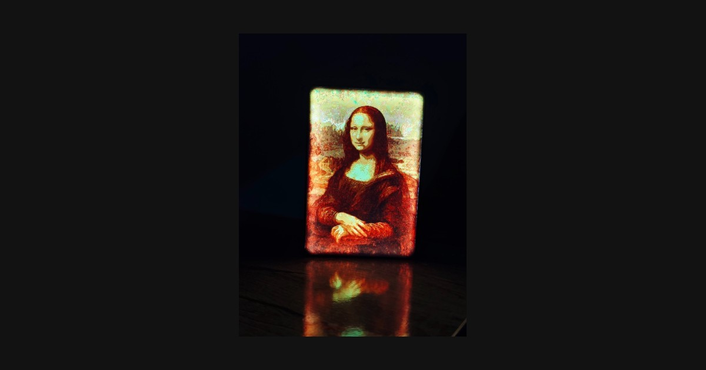
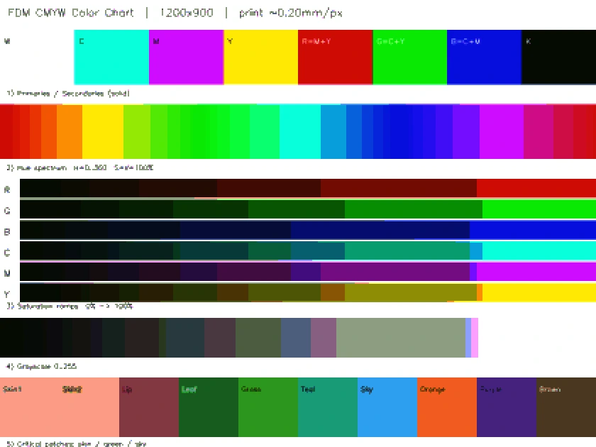
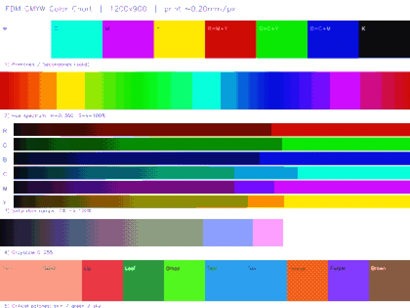

<div align="center">

# CMYW Studio

**Most lithophanes are grayscale. This one prints in full colour.**

Turn any photo into a backlit 3D print — colour and all — by stacking cyan, magenta,
yellow and white filament and letting light do the mixing.

[](LICENSE)
[](https://www.python.org/)
[](https://bambulab.com/)
[](CONTRIBUTING.md)

### [**→ Try it in your browser**](https://my-gpu-node.top/studio)

No install, no account, no upload — the whole pipeline runs on your own device.

[中文说明](README.zh-CN.md) · [How it works](docs/how-it-works.md) · [Printing guide](docs/printing-guide.md)



</div>

---

## What this is

A lithophane encodes an image in the *thickness* of a translucent print — thick where
dark, thin where bright. Every lithophane generator you have used does this in one
colour, so you get a sepia or grey image.

CMYW Studio treats the print as a **subtractive colour stack** instead. Each pixel gets
its own little tower of filament:

| Layer | Filament | Job |
|-------|----------|-----|
| bottom | **White** — 4 layers, fixed | diffuses the backlight into an even ground |
| ↓ | **Yellow** — 0–6 layers | absorbs blue |
| ↓ | **Magenta** — 0–6 layers | absorbs green |
| top | **Cyan** — 0–6 layers | absorbs red |

Light from behind passes through the whole stack, each layer subtracts its part of the
spectrum, and what leaves the front is a colour. At 0.08 mm per layer the entire image
lives in under 1.8 mm of plastic.

The generator also builds a **matching parametric lightbox shell** — rounded corners, a
slot that grips the picture, and a USB-C cutout for the light board — and packs
everything into a single Bambu Studio `.3mf` with the AMS slots and both build plates
already set up.

<div align="center">


<sub>A real print, photographed as it is. No renders.<br>
More samples coming — the gallery is being rebuilt with material we hold the rights to:
public-domain paintings, original art, and AI-generated pieces.</sub>
</div>

## Why it looks better than a naive CMY split

### See it

Same source, same optics, same simulation — only the separation differs. Left is the
naive split this project shipped as its `v1` profile; right is `v2`, which is what you
get today. The source is this project's own CMYW test chart, so the comparison is a
controlled target rather than a flattering photo.

| Naive RGB → CMY split | Adaptive UCR + ordered dithering |
|---|---|
|  |  |
| Neutral and dark areas receive all three colours at once. They collapse into flat black, and what survives posterises into hard bands — only 7 levels per channel. | The shared grey is pulled out and only partly added back, weighted by how dark the pixel already is. Shadows keep their detail, and dithering turns the bands into fine texture. |

Mean brightness of the shadow region (same pixels both sides): **19.9 → 86.2**.

That collapse is the reason colour lithophanes have a reputation for looking muddy. In
a real print it does not read as black — three saturated filaments stacked over a
neutral come out as a grey-brown veil over the whole picture. Pulling the grey back out
is most of what makes the difference, and it uses noticeably less filament as a
side effect.

Reproduce it yourself: `py -3.11 tools/make_comparison.py docs/img/color-chart.png`
(or point it at any photo of your own)

> To be precise about what this shows: it compares **this project's own two profiles**.
> I have not decompiled anyone else's generator, so it is not a claim about what any
> other tool does internally.


Splitting RGB straight into CMY layers gives muddy, grey-veiled results. Two things fix
that, and they are the heart of this project:

**Optical densities, not colour values.** Filament absorption follows Beer–Lambert, so
the code works in density space — `e = (−ln T)^0.72 × 1.78` — rather than treating
layer count as if it were an 8-bit channel.

**Adaptive under-colour removal.** Wherever cyan, magenta and yellow all overlap they
just make grey — expensive, slow to print, and it dulls the image. The generator pulls
that common grey out (`k = min(c, m, y)`), keeps only the chromatic remainder, then adds
a fraction back based on *that pixel's own brightness*, so shadows stay dense and
highlights stay clean. No per-image knob to tune; swap the photo and it re-adapts.

There is a full walkthrough with the formulas in **[docs/how-it-works.md](docs/how-it-works.md)**.

## Quick start

Requires **Python 3.11** (CadQuery, used for the shell, does not support 3.12+ yet).

```bash
git clone https://github.com/2172711631-wq/CMYW_Studio.git
cd CMYW_Studio
pip install -r requirements.txt
```

Convert a photo:

```bash
python cli.py photo.jpg
```

That writes `photo.3mf` — open it in Bambu Studio and print. Some more control:

```bash
# 135 mm wide, white shell
python cli.py photo.jpg --width 135 --shell-color "#FFFFFF"

# exact frame size, no shell — just the picture
python cli.py photo.jpg --width 160 --height 120 --no-shell

# finer grid (sharper, but far more triangles and a slower slice)
python cli.py photo.jpg --mm-per-px 0.15
```

`python cli.py --help` lists everything.

Prefer buttons? `python main.py` opens the desktop app, with a 3D preview of the lit
result before you commit to a print.

> **Windows note:** if `python` points at 3.12, use `py -3.11` instead of `python`.

## Printing it

The short version — full details in **[docs/printing-guide.md](docs/printing-guide.md)**:

| | |
|---|---|
| **Filament** | PLA. Slots 1–4 = Cyan, Magenta, Yellow, White. Slot 5 = shell colour |
| **Layer height** | **0.08 mm** for the picture plate — this is not optional, the colour model assumes it |
| **Shell plate** | 0.2 mm is fine, it is just a box |
| **Infill** | 100% on the picture, or light leaks through the gaps |
| **Backlight** | Any flat, even, diffuse USB-C panel. Point sources produce hotspots |

Print the picture flat on the plate, image side down. Expect a lot of filament changes
— that is the cost of colour, and the prime tower is pre-positioned in the 3MF.

## Project layout

```
main.py                 Colour separation, voxel meshing, 3MF assembly, desktop GUI
cli.py                  Command-line interface
bambu_export.py         Bambu 3MF writer — plates, AMS slots, transforms, thumbnail
shell.py                Lightbox shell built from the CadQuery master
shell_master/           Parametric shell: params.json + CadQuery model + UG/NX expressions
region_mesh.py          Alternative contour-based mesher (experimental)
modifier.py             Small tool for re-exporting at a different size
docs/                   How it works, printing guide
```

## Roadmap

- [x] **Browser version** — the whole engine ported to TypeScript so it runs on your own
      machine or phone with nothing to install, and no upload of your photos anywhere
- [ ] Calibration target + a guide for tuning the optical constants to your filament
- [ ] Regression tests for the separation and shell geometry
- [ ] Non-Bambu output (plain 3MF / per-colour STL) for other multi-material printers

Ideas and pull requests are welcome — see [CONTRIBUTING.md](CONTRIBUTING.md).

## Licence

[PolyForm Noncommercial 1.0.0](LICENSE) — **free for anything that isn't making money.**

**Free, no permission needed:** printing for yourself, your family and your friends;
hobby and amateur projects; personal study and research; teaching, schools and
universities; charities and public institutions; publishing your own forks and
improvements. Use it, change it, share it. You don't need to ask.

**Needs a commercial licence:** selling prints made with it, running a paid service or
site on it, bundling it into a product, or any use with a commercial application behind
it.

That last part isn't a "no" — commercial licences are available, and small operations
are treated kindly. Email **2172711631@qq.com** with the subject "Commercial licence" and say what
you have in mind. Full details in [NOTICE](NOTICE).

Because it restricts commercial use, this is *source available*, not OSI open source.
Everything is public, readable and forkable; the only line is making money from it.

*Releases up to `v1.0.0` were published under MIT and remain usable under those terms —
that grant is not revoked.*

## Acknowledgements

Built for the Bambu Lab X1C + AMS. The optical constants come from a long, expensive
stack of test prints; if you re-derive better ones for your own filament, please open a
PR with your measurements.

<div align="center">
<br>
<sub>If this saved you a few wasted prints, a ⭐ helps other people find it.</sub>
</div>
