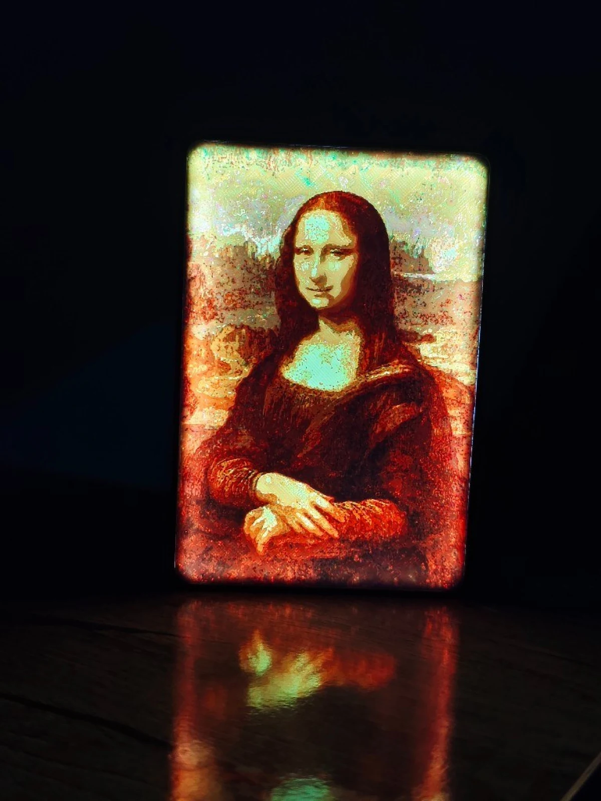

<div align="center">

# CMYW Studio

**别人的光影画是灰的，这个是彩色的。**

把任意照片变成背光 3D 打印件——连颜色一起。青、品红、黄、白四色耗材逐层叠起来，
让光自己把颜色混出来。

[](LICENSE)
[](https://www.python.org/)
[](https://bambulab.com/)
[](CONTRIBUTING.md)

[English](README.md) · [原理详解](docs/how-it-works.md) · [打印指南](docs/printing-guide.md)


</div>

---

## 这是什么

光影画（Lithophane）靠**厚度**编码图像——暗处厚、亮处薄。你见过的生成器基本都是单色的，
所以出来是一张灰的或褐的图。

CMYW Studio 把打印件当成一个**减色叠层**来做。每个像素都有自己的一小摞耗材：

| 层 | 耗材 | 作用 |
|---|---|---|
| 底 | **白** — 固定 4 层 | 把背光打匀，给整幅画一个底 |
| ↓ | **黄** — 0–6 层 | 吸蓝 |
| ↓ | **品红** — 0–6 层 | 吸绿 |
| 顶 | **青** — 0–6 层 | 吸红 |

背光穿过整摞，每层减掉自己那份光谱，从正面出来的就是颜色。层高 0.08mm，
整幅图的信息装在不到 1.8mm 的塑料里。

生成器同时还会建一个**配套的参数化灯箱外壳**——圆角、卡住画片的槽、Type-C 开孔——
然后把所有东西打包成一个 Bambu Studio 的 `.3mf`，AMS 槽位和两个盘都已经排好。

<div align="center">


</div>

## 为什么比直接 CMY 分色好看

把 RGB 直接劈成 CMY 层，出来是发灰发闷的。有两件事把它救回来了，这也是整个项目的核心：

**在光密度里算，不在颜色值里算。** 耗材吸光遵循 Beer–Lambert 定律，所以代码在密度空间工作
——`e = (−ln T)^0.72 × 1.78`——而不是把层数当成 8 位通道来对待。

**自适应底色去除（UCR）。** 青、品红、黄三者重叠的部分只会变成灰——费料、换色慢、还把画面
拉脏。生成器把这份公共灰抽出来（`k = min(c, m, y)`），只留彩色分量，再**按这个像素自己的
亮度**把一部分加回去，于是暗部够沉、高光干净。没有需要逐图微调的旋钮，换张图它自己会变。

完整推导和公式在 **[docs/how-it-works.md](docs/how-it-works.md)**。

## 快速开始

需要 **Python 3.11**（外壳用的 CadQuery 目前还不支持 3.12+）。

```bash
git clone https://github.com/2172711631-wq/CMYW_Studio.git
cd CMYW_Studio
pip install -r requirements.txt
```

转换一张照片：

```bash
python cli.py photo.jpg
```

这会生成 `photo.3mf`，用 Bambu Studio 打开就能打。更多控制：

```bash
# 宽 135mm，白色外壳
python cli.py photo.jpg --width 135 --shell-color "#FFFFFF"

# 精确指定画幅，不要外壳，只出画片
python cli.py photo.jpg --width 160 --height 120 --no-shell

# 更密的网格（更清晰，但面数暴涨、切片变慢）
python cli.py photo.jpg --mm-per-px 0.15
```

`python cli.py --help` 列出全部参数。

想用界面：`python main.py` 打开桌面软件，导出前能先看点亮后的 3D 预览。

> **Windows 提示：** 如果 `python` 指向的是 3.12，把命令里的 `python` 换成 `py -3.11`。

## 怎么打

简版如下，完整版在 **[docs/printing-guide.md](docs/printing-guide.md)**：

| | |
|---|---|
| **耗材** | PLA。1–4 号槽 = 青、品红、黄、白。5 号槽 = 外壳颜色 |
| **层高** | 画片盘 **0.08mm**——这条不能改，颜色模型就是按它算的 |
| **外壳盘** | 0.2mm 就行，它只是个盒子 |
| **填充** | 画片 100%，否则光会从缝里漏 |
| **背光** | 任何平整均匀的 Type-C 漫射灯板。点光源会打出亮斑 |

画片平铺打印，图案面朝下。会换很多次料——这是彩色的代价，擦料塔在 3MF 里已经摆好位置了。

## 项目结构

```
main.py                 分色、体素网格、3MF 组装、桌面 GUI
cli.py                  命令行接口
bambu_export.py         Bambu 3MF 写入器——分盘、AMS 槽位、变换、缩略图
shell.py                灯箱外壳（对接 CadQuery 母本）
shell_master/           参数化外壳：params.json + CadQuery 模型 + UG/NX 表达式
region_mesh.py          备选的轮廓网格化方案（实验性）
modifier.py             改尺寸重导出的小工具
docs/                   原理详解、打印指南
```

## 路线图

- [ ] **浏览器版**——整个引擎移植到 TypeScript，在你自己的电脑或手机上跑，
      不用装任何东西，照片也不会上传到任何地方
- [ ] 校准靶图 + 针对自己耗材调光学常数的指南
- [ ] 分色与外壳几何的回归测试
- [ ] 非 Bambu 输出（通用 3MF / 分色 STL），支持其它多材料打印机

欢迎提想法和 PR，见 [CONTRIBUTING.md](CONTRIBUTING.md)。

## 许可

[PolyForm Noncommercial 1.0.0](LICENSE) —— **只要不拿它赚钱，随便用。**

**免费，不用申请：** 给自己、家人、朋友打印；业余爱好与个人项目；个人学习与研究；
教学、学校与高校；慈善机构与公共机构；公开你自己的分支和改进。
用它、改它、分享它，都不需要问我。

**需要商业授权：** 售卖用它生成的打印件、拿它开收费服务或网站、
把它打包进商业产品，或任何带商业预期的使用。

最后这条不是「不行」——**商业授权是可以买的**，小本经营好商量。
开一个标题为 **「Commercial licence」** 的 issue，说说你想做什么就行。详见 [NOTICE](NOTICE)。

因为限制了商业用途，这属于**源码公开（source available）**，不是 OSI 定义的开源。
所有代码都公开、可读、可 fork，唯一的红线是拿它赚钱。

*`v1.0.0` 及更早的发布采用 MIT 协议，那些版本仍可按 MIT 使用——已给出的授权不撤销。*

## 致谢

为 Bambu Lab X1C + AMS 而做。那组光学常数是拿一大摞打废的测试件换来的；
如果你为自己的耗材标定出了更好的值，欢迎带上测量数据提 PR。

<div align="center">
<br>
<sub>如果它帮你少打废几件，点个 ⭐ 能让更多人看到。</sub>
</div>
